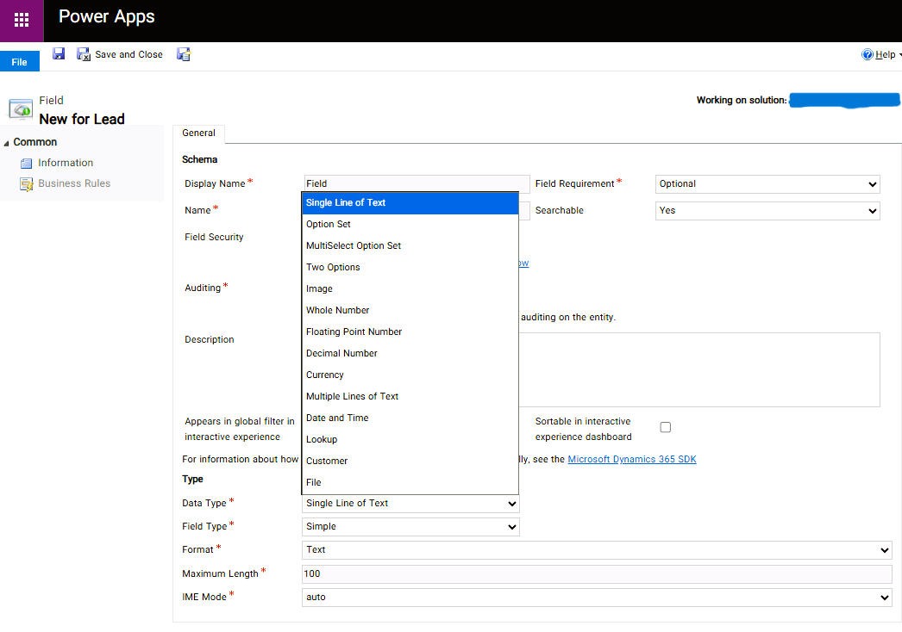

# 🧩 Understanding Field Types in Dynamics 365

When creating a new field in Dynamics 365 (Dataverse), you can choose from different **data types** depending on what kind of information you want to store.  
Choosing the right type is important — it affects how data is stored, displayed, and integrated across the system.

---

## 📸 Screenshot

---

## 🔍 Common Field Types

| Field Type | Description | Example |
|-------------|-------------|----------|
| **Single Line of Text** | Stores short text values such as names or titles. | Customer Name |
| **Multiple Lines of Text** | Stores longer text values, such as notes or comments. | Description |
| **Option Set** | Displays a dropdown list of predefined options. | Status (Active / Inactive) |
| **MultiSelect Option Set** | Allows selection of multiple options from a list. | Preferred Contact Methods |
| **Two Options** | Represents Yes/No, True/False, or On/Off values. | Is Active |
| **Whole Number** | Stores integer numbers. | Quantity |
| **Decimal Number** | Stores decimal numbers with defined precision. | Weight |
| **Floating Point Number** | For approximate numeric values with floating precision. | Temperature |
| **Currency** | Used for money values, formatted by currency settings. | Invoice Amount |
| **Date and Time** | Stores date or date & time values. | Created On |
| **Lookup** | Links this record to another entity/table. | Account |
| **Image** | Used to store a picture or image file. | Product Image |
| **File** | Allows file uploads within a record. | Attachment |

---

💡 **Tip:** Choose your field type carefully!  
It impacts reporting, filtering, and integrations in Power Platform.

---

✍️ **Author:** fatima-co
📅 **Date:** October 2025  
🔗 **LinkedIn:** https://www.linkedin.com/posts/fatimakhodaei_fields-in-dynamics365-activity-7388129782653214720-ScEv?utm_source=share&utm_medium=member_android&rcm=ACoAACgDlwYBETzVleV0vOKOxUM_fv8MdngRidU
